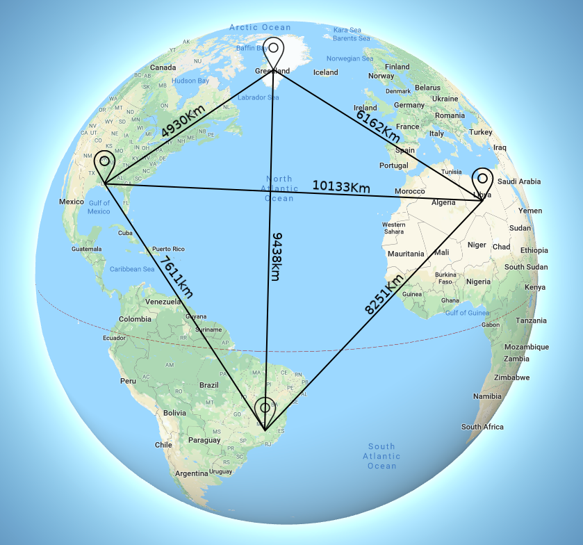
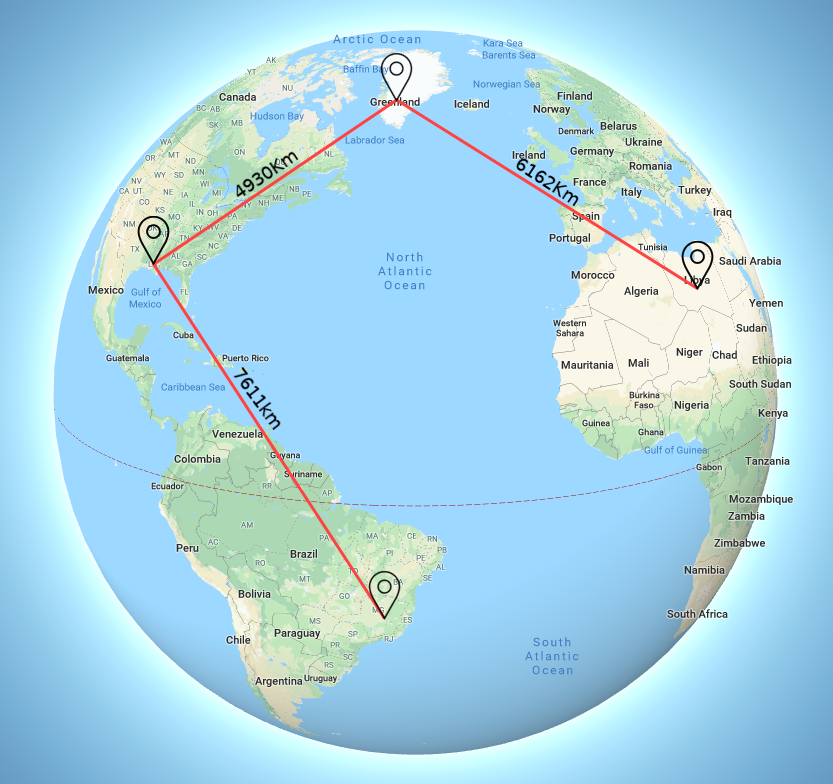

# Minimum Bottleneck Spanning Tree

Minimum bottleneck spanning tree (MBST) in an undirected graph is a spanning tree in which the most expensive edge is as cheap as possible. A bottleneck edge is the highest weighted edge in a spanning tree. A spanning tree is a minimum bottleneck spanning tree if the graph does not contain a spanning tree with a smaller bottleneck edge weight. In this assignment, the problem is to find the smallest cost to connect a network of radio telescopes around the world given the position of each one. The example below shows the position and the minimum bottleneck spanning tree for the given distribution of radio telescope.

  
